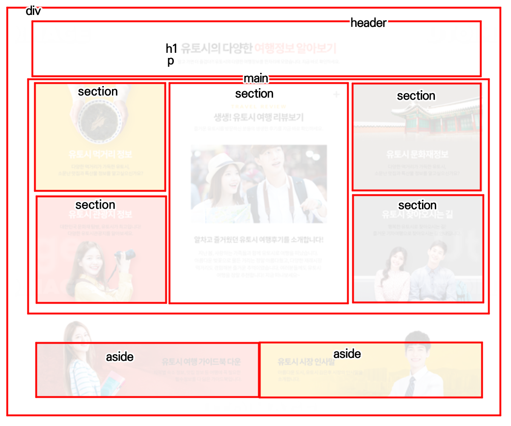
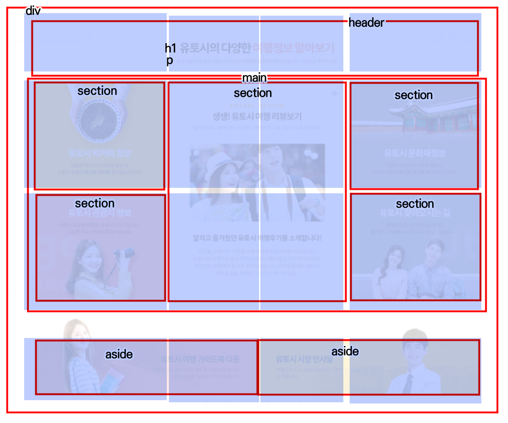

## 목차

1. [마크업](#마크업)
2. [스타일링](#스타일링)
3. [결론과 회고](#결론과-회고)

## 마크업

### div

> 요소 전체를 div로 래핑함

### header

> 웹 사이트의 입문을 알리는 헤더 영역을 header 클래스로 선언 이후 `h1` 제목과 `p` 부가설명을 추가하였다.

### main

> 5개의 `section`으로 이뤄진 main 내용.
>
> ### section
>
> > 먹거리 정보, 관광지 정보, 문화재 정보, 찾아오는 길은 `h2`제목과 `p`설명을 제공하고, 가운데의 **여행 리뷰 보기** `section`에는 `h2`제목과 `img`, `p` 설명을 제공하였다.

### aside

- If the contents represent useful tangential information that works alongside the main content, but is not directly part of it (like related links, or an author bio)

> MDN의 aside 설명에 따라서 다운로드 링크와 다른 페이지로 이어지는 영역 두 개를 aside로 지정했다.
> a 태그의 보안을 위해 "target=\_\_blank" 속성과 rel="noopener noreferrer" 속성을 부여했다.

## 스타일링

## .container

`display:grid` 설정

열 : `container-start - review-start - guide-box - review-end - container-end` 로 구간을 나누어 총 4개의 열 지정
행 : `repeat(4, auto)`

## .header

`display : grid` 설정

> 내부 `h1`, `p` justify-self : center 속성으로 중앙 정렬

> `justify-self`를 사용할 경우, 해당 아이템이 block 속성이고, parent 속성이 `display: grid` 또는 `display:flex-grid`여야 한다.

## .main

열 : 그리드 전체 설정,
행 : 2행부터 4행까지 설정

subgrid 영역 선언

각 5개 `section` 그리드 위치 설정,
정가운데 섹션의 경우, 이미지 가운데 정렬을 위해 `display:grid` 속성 부여
